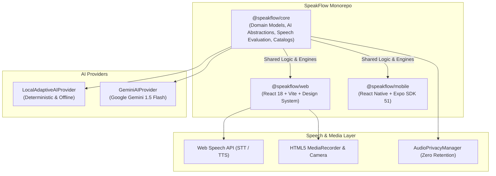

# 🎙️ SpeakFlow

<div align="center">

[](LICENSE)
[](https://www.typescriptlang.org/)
[](https://reactjs.org/)
[](https://vitejs.dev/)
[](https://expo.dev/)
[](packages/core/test)

**Production AI English Speech, Pronunciation & Communication Coach**

*Transform your spoken English with real-time phoneme evaluation, adaptive daily practice sessions, video reading studio, grammar labs, and conversational intelligence.*

[Explore Features](#-features) • [Architecture](#-architecture) • [Quickstart](#-getting-started) • [Mobile App](#-mobile-app-ios--android) • [Environment Setup](#-environment-variables)

</div>

---

## 🌟 Overview

**SpeakFlow** is an end-to-end, privacy-centric AI speech training ecosystem built for non-native English speakers, professionals, and language learners. Whether you are preparing for workplace presentations, job interviews, or everyday fluency, SpeakFlow combines phoneme-level diagnostic tracking, real-time speech synthesis/recognition, adaptive learning engines, and interactive AI scenarios to accelerate speaking mastery.

### Why SpeakFlow?

- **Zero-Judgment Practice**: Train without stage fright using intelligent AI feedback loops and offline-ready local intelligence.
- **Evidence-Based Progression**: Tracks 16+ specific phoneme categories (such as `/θ/` vs `/ð/`, `/v/` vs `/w/`, consonant clusters, and syllable stress).
- **Turnkey Cross-Platform Engine**: 100% shared domain logic in `@speakflow/core` drives both the desktop/PWA web client and native iOS/Android mobile apps.
- **Strict Privacy**: Zero audio retention architecture. Speech streams are evaluated ephemerally in-memory with automatic buffer flushing.

---

## ✨ Features

### 1. 📖 200-Word Reading Studio & Video Teleprompter
- **Curated Reading Passages**: Daily passages strictly adhering to 160–200 words with CEFR-graded difficulty levels (A1 to C2).
- **Integrated Video Mirror & Teleprompter**: Record your speaking delivery on camera with synchronized auto-scrolling teleprompter, mirror flip, live WPM (Words Per Minute) pace tracker, and instant downloadable MP4/WebM recordings.
- **Real-Time Word Matching**: Token-level speech recognition highlights successfully pronounced words in real time.

### 2. ⚡ Tongue Twisters & Phoneme Gym
- Targeted pronunciation drills categorized by phonetic trouble spots:
  - Consonant clusters (`/str/`, `/spl/`, `/thr/`)
  - Dental fricatives (`TH` /θ/ vs /ð/)
  - Labiodental & bilabial contrasts (`V` vs `W`, `P` vs `B`)
  - Sibilants & liquids (`S` vs `SH`, `R` vs `L`)
- Multi-speed pacing (Slow, Moderate, Challenge Mode) with interactive playback synthesis.

### 3. ✨ Words & Daily Grammar Lab
- **Practical Articles & Prepositions**: Dedicated daily rules targeting common non-native pitfalls (*"in" vs "at" vs "on"*, *"a" vs "an" before vowel sounds*, zero-article usage).
- **Real-World Office Idioms**: Workplace phrases with practical contexts, speaker dialogues, and audio pronunciation examples.
- **Daily Rotation**: Systematic calendar-driven catalog ensuring varied daily mastery.

### 4. 🌐 Daily Hindi-to-English Conversational Phrases
- Curated library of 80+ everyday communicative phrases translated from Hindi (हिंदी) to natural, fluent spoken English.
- Dual-script representation (English, Devanagari script, and Romanized phonetic guide).
- Category filtering: Daily Routines, Professional & Office, Formal Polite, Travel, and Idiomatic Expressions.

### 5. 🤖 Adaptive AI Coach, Impromptu Speaking & Essay Writing
- **Multi-Turn Voice Conversations**: Roleplay real-life scenarios (Job Interview, Executive Presentation, Customer Negotiation, Daily Small Talk).
- **Impromptu Speaking Mode**: Timed spontaneous speech drills with real-time pause detection, filler-word tracking (`um`, `like`, `you know`), and coherence scores.
- **AI Writing & Grammar Studio**: Instant essay proofreading with structural clarity suggestions, vocabulary enhancement, and CEFR level grading.
- **Dual AI Engine**:
  - **Local Adaptive Mode**: Instant heuristics and offline-capable coaching algorithms.
  - **Google Gemini 1.5 Flash Mode**: Deep conversational reasoning and rich feedback.

### 6. 📊 Honest Analytics & Streaks
- Data-driven phoneme weakness heatmaps.
- Daily practice streak logic requiring comprehensive stage completion.
- Spoken words count, fluency score, and historical mastery benchmarks without vanity numbers.

---

## 🏗️ Architecture

SpeakFlow is organized as an enterprise TypeScript monorepo with clean separation of concerns:



### Monorepo Structure

```text
SpeakFlow/
├── apps/
│   ├── web/                    # Production React 18 + Vite Web Application
│   │   ├── src/
│   │   │   ├── components/     # UI Views (Reading, Twisters, Grammar, Phrases, Coach)
│   │   │   ├── design-system/  # Obsidian dark & light design system tokens
│   │   │   ├── speech/         # Browser speech synthesis and recognition services
│   │   │   ├── storage/        # Resilient BrowserStorage with schema migration
│   │   │   └── App.tsx         # Main application shell with hash & path routing
│   │   └── package.json
│   └── mobile/                 # React Native & Expo SDK 51 client
│       ├── app.json            # Expo configuration (iOS Bundle ID & Android Package)
│       ├── eas.json            # Expo Application Services build profiles
│       └── package.json
├── packages/
│   └── core/                   # Platform-agnostic core logic
│       ├── src/
│       │   ├── ai/             # LocalAdaptiveAIProvider, GeminiAIProvider
│       │   ├── domain/         # Reading passages, twisters, warmups, grammar catalog
│       │   ├── learning/       # AdaptiveIntelligence, DailyPracticeEngine, Tracker
│       │   ├── privacy/        # AudioPrivacyManager (0-retention buffer manager)
│       │   ├── speech/         # PronunciationEvaluator, Phonetic distance scoring
│       │   └── validation/     # ContentValidator (Word count, sentence metrics)
│       ├── test/               # Node.js native test suite (22 tests)
│       └── package.json
├── .env.example                # Environment variables template
├── package.json                # Monorepo workspaces configuration
└── tsconfig.base.json          # Shared TypeScript compiler options
```

---

## 🚀 Getting Started

### Prerequisites

- **Node.js**: `v20.x` or higher
- **npm**: `v10.x` or higher

### 1. Clone & Install

```bash
git clone https://github.com/Amitprasad-1/SpeakFlow.git
cd SpeakFlow

# Install all monorepo dependencies
npm install
```

### 2. Configure Environment

Copy the example environment file:

```bash
cp .env.example .env
```

*(Optional)* To enable server-side Google Gemini AI reasoning, add your Gemini API key:

```env
GEMINI_API_KEY=your_google_gemini_api_key_here
GEMINI_MODEL=gemini-1.5-flash
AI_PROVIDER=local_adaptive
```
> **Note**: SpeakFlow works out-of-the-box in **100% offline mode** using `LocalAdaptiveAIProvider` without requiring external API keys.

### 3. Build Core Package

```bash
npm run build:core
```

### 4. Start Web Application

```bash
npm run dev
```

Open [http://localhost:5173](http://localhost:5173) in your browser to experience SpeakFlow.

---

## 🧪 Testing & Validation

SpeakFlow includes automated tests verifying catalog integrity, word-count adherence, streak logic, phoneme tracking, and adaptive coaching:

```bash
# Run all unit and integration tests
npm test
```

Expected output:
```text
# tests 22
# suites 2
# pass 22
# fail 0
```

---

## 📱 Mobile App (iOS & Android)

SpeakFlow includes a mobile app built with **Expo SDK 51** and **React Native**:

```bash
# Start Metro bundler
npm run start --workspace=@speakflow/mobile

# Run directly on connected Android device / emulator
npm run android --workspace=@speakflow/mobile

# Run directly on iOS simulator (macOS)
npm run ios --workspace=@speakflow/mobile
```

### Production Mobile Builds (EAS)

Create release binaries ready for app store distribution:

```bash
cd apps/mobile

# Android App Bundle (.aab) for Google Play Console
npm run build:android

# iOS Archive (.ipa) for Apple TestFlight / App Store
npm run build:ios
```

---

## 📜 Monorepo Scripts Reference

| Script | Command | Description |
|---|---|---|
| `npm run dev` | `npm run dev --workspace=@speakflow/web` | Starts the Vite development server with Hot Module Replacement |
| `npm run build` | `npm run build:core && npm run build:web` | Compiles `@speakflow/core` and creates the production web bundle |
| `npm run build:core`| `npm run build --workspace=@speakflow/core` | Transpiles the TypeScript core engine into `dist/` |
| `npm run build:web` | `npm run build --workspace=@speakflow/web` | Typechecks and bundles the React web application |
| `npm test` | `node --test packages/core/test/**/*.test.mjs` | Executes the test suite using Node's test runner |

---

## 🔒 Privacy & Data Protection

- **No Voice Storage**: Audio streams from microphones are processed ephemerally in browser memory and flushed after scoring.
- **Configurable Retention**: The `ALLOW_VOICE_DATA_RETENTION=false` flag strictly guarantees zero audio storage on disk or remote servers.
- **Local-First Storage**: User profiles, progress statistics, and learning streaks remain securely stored in the client's `localStorage` / `IndexedDB`.

---

## 🛠️ Tech Stack

- **Frontend**: [React 18](https://react.dev/), [TypeScript 5](https://www.typescriptlang.org/), [Vite](https://vitejs.dev/)
- **Styling & UI**: Custom Vanilla CSS Design System with Obsidian Dark / Light modes, CSS variables, and Lucide Icons
- **Mobile**: [Expo SDK 51](https://expo.dev/), [React Native](https://reactnative.dev/), EAS Build
- **Speech Technologies**: Web Speech API (SpeechRecognition & SpeechSynthesis), HTML5 MediaDevices API
- **AI Intelligence**: Google Gemini API (`@google/genai` compatible REST integration) & Local Heuristic Engine
- **Test Runner**: Node.js Native Test Runner (`node:test`, `node:assert`)

---

## 🤝 Contributing

Contributions are warmly welcomed! To contribute:

1. **Fork the repository**
2. **Create your feature branch**: `git checkout -b feature/amazing-feature`
3. **Commit your changes**: `git commit -m 'feat: add amazing feature'`
4. **Run the test suite**: `npm test`
5. **Push to the branch**: `git push origin feature/amazing-feature`
6. **Open a Pull Request**

---

## 📄 License

This project is open-source and licensed under the [MIT License](LICENSE).

---

<div align="center">
Made with ❤️ for English learners worldwide by the <strong>SpeakFlow Team</strong>.
</div>
